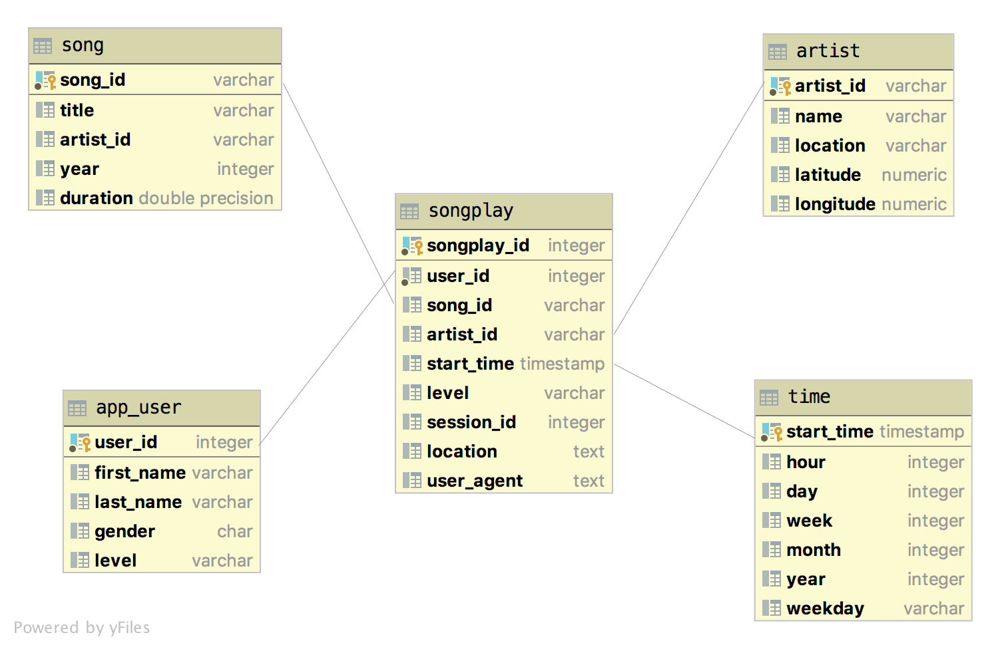

# Data Modeling with Postgres
Project from Udacity's Data Engineer Nano Degree. ETL pipeline to ingest songs and user activity data.

# Setup
Project is using python 3. Install dependencies:
```
pip install -r requirements.txt
```

Postgres database is assumed to connect with these configs:
```
host=127.0.0.1
dbname=studentdb
user=student
password=student
```

# Run Project
```
python3 create_tables.py
python3 etl.py
```

# Project Structure

| Folder / File    | Description                                                       |
|------------------|-------------------------------------------------------------------|
| data folder      | Contains songs and user activity data.                            |
| sql_queries.py   | Sql commands.                                                     |
| create_tables.py | Creates songplay, app_user, song, artist and time tables.         |
| etl.py           | Process the files in data folder and stores the data in database. |


# Implementation Details
First, we create all the database tables. Next, we will perform ETL on the first dataset, `data/song_data`, to create the `song` and `artist` dimensional tables. Also, we will perform ETL on the second dataset, `data/log_data`, to create the `time` and `app_user` dimensional tables, as well as the `songplay` fact table.

## Database Design
The denormalised star schema was choose to enable simplified queries. The fact table is songplay, and the 4 other tables are dimension tables.


## ETL Process
- Create all tables
- Read song and data files
- Song data processing
    - Extract song id, title, etc. Loads as song.
    - Extract artist idm artist name, etc. Loads as artist.
- Log data processing
    - Extract start time and transform it to fields such as hour and day. Loads as time.
    - Extract user id, first name, etc. Loads as user.
    - Retrieve song id and artist id. Extract user id, level, etc. Loads as songplay.